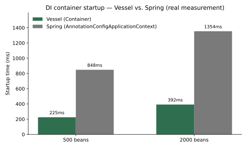

# Vessel


A didactic Java 21 micro-framework — DI container, HTTP server, routing, and configuration, built from scratch to learn the mental model behind Spring Boot by implementing every layer by hand.

> **Educational project — do not use in production.** Vessel has zero runtime dependencies, no persistence, no security, no templating, and no auto-configuration. Every design decision favors learning over feature completeness. See [`docs/`](docs/README.md) for a full per-module guide with examples.

## Why

Frameworks like Spring Boot feel like magic until you build a small version of one yourself. Vessel exists to answer, concretely: what *is* dependency injection, really? What does `@Autowired` actually do at runtime? Why does a bean factory need to detect cycles? Why does Spring Boot take longer to start with more beans? Each milestone (M0–M11) below picks one piece of that machinery and implements it with no shortcuts — no reflection library, no bytecode generation, no third-party DI/HTTP framework underneath.

## Quick example

This is the real, runnable code in [`vessel-examples/`](vessel-examples/src/main/java/io/vessel/examples) — trimmed here to the essentials (`UserNotFoundException` omitted for brevity, but it's just three lines):

```java
// === HelloApplication.java ===
@Server(port = 8080, host = "localhost")
@Application
public class HelloApplication {
    public static void main(String[] args) {
        Vessel.start(HelloApplication.class);
    }
}

// === User.java ===
public record User(long id, String name, String email) {}

// === UserService.java ===
@Component
public class UserService {

    private final List<User> users = new ArrayList<>(List.of(
        new User(1, "Alice", "alice@example.com"),
        new User(2, "Bob", "bob@example.com")));

    public List<User> findAll() { return List.copyOf(users); }

    public User findById(long id) {
        return users.stream().filter(u -> u.id() == id).findFirst()
            .orElseThrow(() -> new UserNotFoundException(id));
    }

    public User save(User user) { users.add(user); return user; }
}

// === UserController.java ===
@RestController
public class UserController {

    private final UserService userService;

    @Inject
    public UserController(UserService userService) { this.userService = userService; }

    @Get("/users")
    public List<User> users() { return userService.findAll(); }

    @Get("/users/{id}")
    public Response<User> getUser(@PathVariable long id) { return Response.ok(userService.findById(id)); }

    @Post("/users")
    @ResponseStatus(HttpStatus.CREATED)
    public User createUser(@RequestBody User user) { return userService.save(user); }

    @ExceptionHandler(UserNotFoundException.class)
    public Response<ErrorResponse> handleNotFound(UserNotFoundException e) {
        return Response.status(HttpStatus.NOT_FOUND, new ErrorResponse("USER_NOT_FOUND", e.getMessage()));
    }
}
```

```bash
$ ./gradlew :vessel-examples:run &
$ curl http://localhost:8080/users
[{"id":1,"name":"Alice","email":"alice@example.com"},{"id":2,"name":"Bob","email":"bob@example.com"}]

$ curl http://localhost:8080/users/99
{"status":404,"error":"USER_NOT_FOUND","message":"User 99 not found","timestamp":"2026-08-25T04:50:59Z"}

$ curl -X POST http://localhost:8080/users -d '{"id":3,"name":"Charlie","email":"charlie@example.com"}'
{"id":3,"name":"Charlie","email":"charlie@example.com"}
```

`Vessel.start()` reads `@Server`, loads `application.properties` (which can override the annotation's port/host), boots the DI container, scans for `@Component`s and then `@RestController`s, validates the *entire* dependency graph up front — a wiring mistake fails at startup, never on the first request that happens to hit it — and only then binds the socket.

## Vessel → Spring Boot

The naming is deliberately not a copy of Spring's, but the concepts map directly, one for one:

| Vessel | Spring Boot | Module | Note |
|---|---|---|---|
| `@Component` | `@Component` | core | No `@Service`/`@Repository` stereotypes |
| `@Inject` | `@Autowired` | core | Constructor injection only |
| `@Qualifier` | `@Qualifier` | core | Same idea |
| `@Primary` | `@Primary` | core | Same idea |
| `@Scope` | `@Scope` | core | Only `SINGLETON` and `PROTOTYPE` |
| `@PostConstruct` | `@PostConstruct` | core | JSR-250 equivalent |
| `@PreDestroy` | `@PreDestroy` | core | JSR-250 equivalent |
| `@Configuration` + `@Bean` | same | core | No proxying between `@Bean` methods |
| `Supplier<T>` parameter | `ObjectProvider<T>` / `@Lazy` | core | Defers resolution to break a cycle deliberately |
| `@Timed` | AOP `@Around` advice | core | `java.lang.reflect.Proxy` only — interface-based beans only |
| `@Value("${key}")` | `@Value` | config | No SpEL |
| `Environment` / `Configuration` | `Environment` / `PropertySourcesPlaceholderConfigurer` | config | System property > env var > properties file |
| `@RestController` | `@RestController` | web | Implies `@Component` |
| `@Get` / `@Post` / `@Put` / `@Delete` | `@GetMapping` / `@PostMapping` / etc. | web | Simplified names |
| `@PathVariable` | `@PathVariable` | web | Same idea |
| `@RequestParam` | `@RequestParam` | web | Same idea |
| `@RequestBody` | `@RequestBody` | web | Same idea |
| `@ResponseStatus` | `@ResponseStatus` | web | Same idea |
| `@ExceptionHandler` | `@ExceptionHandler` | web | No `@ControllerAdvice` — scoped per controller |
| `@Before` / `@After` | `HandlerInterceptor` | web | Scoped per controller, at most one of each |
| `@Server` | `@Server` / `server.*` properties | http | Declarative server config on the annotation |
| `Response<T>` | `ResponseEntity<T>` | http | Simplified name |
| `HttpStatus` | `HttpStatus` | http | Full coverage of the standard (60+ codes) |
| `CorsConfig` | `CorsConfiguration` | http | Minimal — configured via `@Server` |
| `withVirtualThreads()` | (server-container specific) | http | Opt-in — see the concurrency caveat in its Javadoc |
| `Container` | `ApplicationContext` | core | Much smaller |
| `@Application` | `@SpringBootApplication` | app | Simpler |
| `Vessel.start()` | `SpringApplication.run()` | app | Explicit bootstrap |
| `application.properties` | same | config | No YAML, no profiles — overrides `@Server`'s defaults |

## Benchmark: Vessel vs. Spring

One of the M11 stretch goals is a real, measured comparison — not a guess — of DI container startup cost against Spring, since "why does Spring Boot take longer to start with more beans" is exactly the kind of question this whole project exists to turn from folklore into something observed.



Both sides measure the same thing: wall-clock time from creating an empty DI container to every bean being resolved, after scanning a package of N generated, real, distinct classes (`generated.Bean0000`, `generated.Bean0001`, ...) — Vessel via `Container.scan()` + `Container.resolveAll()`, Spring via `new AnnotationConfigApplicationContext(...)` with `@ComponentScan`. Deliberately `spring-context` alone, not full Spring Boot — Vessel has no auto-configuration layer to weigh that comparison down with, so comparing raw DI container against raw DI container is the fairer measurement. A single cold run each, not an average over warmed-up iterations: what matters for "startup time" is the one measurement a real deployment actually experiences, not steady-state throughput.

The ratio holds at roughly 3–4× across both sizes tested, which suggests the gap scales with the number of beans rather than being a fixed cost on one side — consistent with the intuition already written up after M10 ("why Spring Boot takes a while to boot"): it isn't one slow phase, it's more reflection and more bean-lifecycle machinery (post-processors, proxying, multi-phase `BeanDefinition` handling) repeated for every single bean.

This lives entirely outside the main build — `benchmarks/vessel-startup/` and `benchmarks/spring-comparison/` are standalone Gradle projects, never listed in the root `settings.gradle.kts`, never touched by `./gradlew build`. `spring-comparison/` is the only place in this whole repository that depends on Spring. To reproduce:

```bash
cd benchmarks/vessel-startup && ../../gradlew run -PbeanCount=500
cd benchmarks/spring-comparison && ../../gradlew run -PbeanCount=500
```

The benchmark's own Gradle setup had two real bugs before these numbers could be trusted — a stale-cache issue where changing `beanCount` didn't actually regenerate the classes, and shrinking `beanCount` leaving old generated files behind, inflating the count. Both are fixed now (`inputs.property("beanCount", ...)` and clearing the output directory before regenerating).

## Building and testing

```bash
make help    # every available command, documented
make build   # full build, every module
make test    # every module's tests, without assembling jars
make run     # example app on http://localhost:8080
```

`make help` is a thin, documented wrapper around the Gradle commands below — nothing in it is load-bearing, it only exists to save typing. Run Gradle directly if you'd rather:

```bash
./gradlew build                  # full build, every module
./gradlew :vessel-core:test      # a single module's tests
./gradlew :vessel-http:test
./gradlew :vessel-web:test
./gradlew :vessel-config:test
./gradlew :vessel-app:test
./gradlew :vessel-examples:run   # run the example app on http://localhost:8080
```

Requires Java 21. Zero third-party runtime dependencies in any module — `testImplementation` JUnit 5 (via `gradle/libs.versions.toml`) is the only exception, anywhere in the main build.

## Modules

```
vessel-core/      DI container — annotations, graph, scanning, lifecycle. Depends on nothing.
vessel-http/      Pure HTTP primitives — request/response, router, status, @Server. Depends on nothing.
vessel-web/       Controllers, dispatcher, argument resolver, JSON serializer. Depends on core + http.
vessel-config/    Properties, Environment, @Value. Depends on core.
vessel-app/       Bootstrap (Vessel.start()), @Application. Depends on all of the above.
vessel-examples/  Runnable example app — User/UserService/UserController. Depends on vessel-app.
```

`vessel-core` and `vessel-http` are the leaves of the dependency graph — they never import from another Vessel module, by design.

## Milestones

M0 through M11 are all implemented and tested — see [`docs/`](docs/README.md) for a guided, example-driven walkthrough of what each module actually does.

| Milestone | What it built |
|---|---|
| M0 | DI container without annotations — dependency graph, cycle/missing-dependency detection |
| M1 | `@Component`/`@Inject` + classpath scanning |
| M2 | `@Qualifier`/`@Primary`/`@Scope`, `List<T>` injection |
| M3 | `@PostConstruct`/`@PreDestroy` lifecycle, `@Configuration`/`@Bean` |
| M4 | Pure HTTP layer, `@Server` |
| M5 | Router — exact and parameterized routes |
| M6 | Controllers, dispatcher, argument resolution |
| M7 | Hand-rolled JSON parser/serializer |
| M8 | `@ExceptionHandler`, standardized error responses |
| M9 | `PropertySource`/`Environment`/`@Value`, type conversion |
| M10 | `Vessel.start()` — full bootstrap orchestration |
| M11 | Stretch goals: lazy injection (`Supplier<T>`), `@Timed` interception, virtual threads, hot-reload, `@Before`/`@After` middleware, and the benchmark against Spring above |
